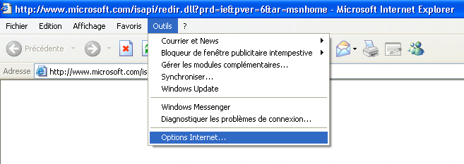
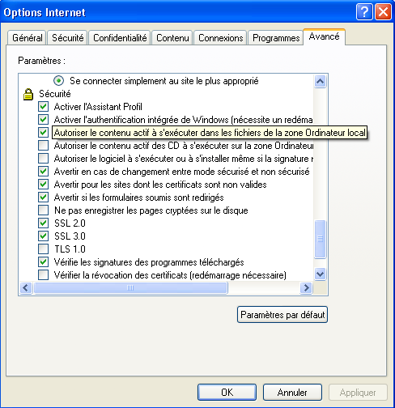
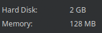
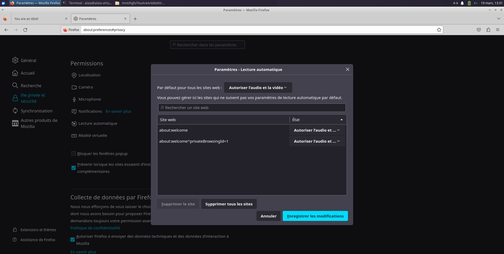
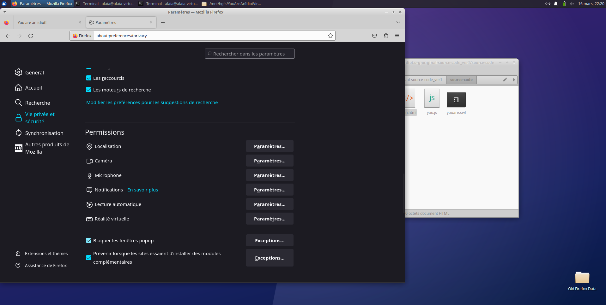
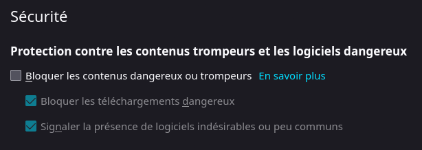
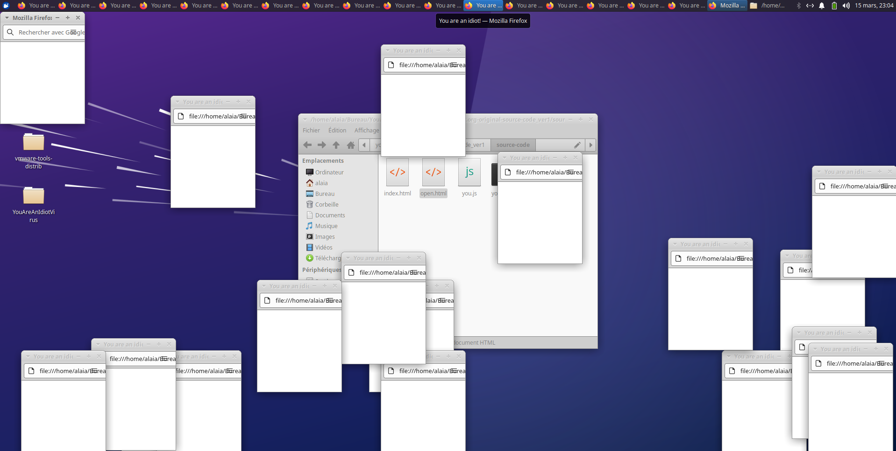

<b>↓read this if you need to↓</b>
- this is the source code of <a href="http://youareanidiot.org/">youareanidiot.org/</a> from 2004-2009.<br>
- before 2010, when you went to <a href="http://youareanidiot.org/">youareanidiot.org/</a> and then backed-out-of/closed the tab, you were greeted with <b>the meaning of life</b> (windows flying around your screen with a .SWF file flashing, displaying "you are an idiot!" while singing beautifully about the fact that you are an idiot).<br>
- but now the windows flying around the screen doesn't happen anymore if you go to the original site. :(<br>
- soooooooo i dug around a bit on the <a href="https://archive.org/web/">way back machine</a> and gathered this source code to put in this repository.<br>
↓<b>read this if you want to worry about other things↓</b><br>
- upon downloading the source code folder to your computer, your antivirus will probably remove the download due to the "you.js" file within the download.<br>
<b><i>if you're not looking for complications!:</i></b><br>
you could just download <i><b>only</b></i> the "you-are-an-idiot-virus.html" file which sources all the other files from this repository <br>

# You Are An Idiot in 2023
***
This version is a bit different from the original. It's a bit more modern (works on Firefox on Xubuntu), and it's a bit more annoying.
## Table of Contents
1. [General Info](#general-info)
2. [Installation](#installation)
3. [FAQs](#faqs)
4. [Thanks to](#thanks-to)
***
### General Info
First of all, if you are reading this, you are an idiot. Second, if you happen to have any form of epilepsy, stop reading and go do something else. There is a lot of flashing in this virus so please don't sue us. Third, if you are reading this, you are an idiot.
Because the virus is so old, it used Adobe Flash Player, which is no longer supported. This is really sad. We have updated the virus to use HTML5, and it works on Firefox on Xubuntu. It hasn't been tested on other browsers because it's really annoying and we only want to annoy other people, not be the ones annoyed. It also works a little differently.
#### Windows XP
In the Windows XP version, windows would appear until you had to close them all with the task manager. You couldn't close them one by one because 6 other windows would open and scare you to death. This would generally freeze your computer and you had to reboot it. Because computers in 2004 had so little RAM, sometimes you couldn't even open the task manager and could just watch your computer slowly die.
#### Xubuntu 22.04
Since most computers' RAM is over 128 MB nowadays, opening windows 6 by 6 would take forever to crash your computer. Instead, you can close the windows one by one, but they will just keep opening. You can close them all, but they will just keep opening. When you think you've closed them all, they will just keep opening. You can't close them all, and you can't close them one by one. You can't do anything. You are trapped in a never-ending loop of windows opening and closing. You are an idiot.
***
### Installation
```
git clone https://github.com/Grillacier/youareanidiot.org-original-source-code
```
#### Windows XP
If you happen to own a virtual machine with Windows XP, first of all, why? Second, you have to "Allow active content to run in files on My Computer" in Internet Explorer in order to run the virus. You can do this by going to Tools > Internet Options > Advanced tab > Security > Allow active content to run in files on My Computer.   (pardon my french, nobody's perfect) If you want to install Windows XP, you can give it 2GB of storage and 128MB of RAM.  This way, you'll feel like you're back in 2004.
Then, copy the repository to the virtual machine by enabling the shared folder in VirtualBox/VMware/whatever-you-are-using. The file to open is "open.html" because we believe that you are an idiot. It is situated in the "source-code" folder. When you are tired of the virus mocking you, press Ctrl+Alt+Esc to open the task manager. Select all of the pages at once and click "End Task".
#### Xubuntu 22.04
We believe you are using Firefox since it's installed by default when you download Xubuntu. Open your browser, click the menu button and select Settings > Privacy & Security > Permissions > Autoplay > Settings... > Default for all websites > Allow Audio and Video.  Still in Permissions, uncheck Block pop-up windows.  Finally, in the Security section, uncheck Block dangerous and deceptive content because why not. 
The file to open is once again "open.html" but this time it's in the "source-code-linux" folder. When you feel like you've had enough, open a terminal. Type "killall -9 firefox" and press Enter.
If you don't want to see the flashing lights and hear the annoying music you can open the "open.html" file in the "source-code" folder. Since this one uses Flash Player, which is no longer supported, the music and animation will not work. 
***
### FAQs
1. **Why did you make this?**
We are idiots.
***
### Thanks to
We would like to thank github user https://github.com/AntnPantnMantn for making this repository. None of us know anything about HTML or JavaScript, so we are very grateful.